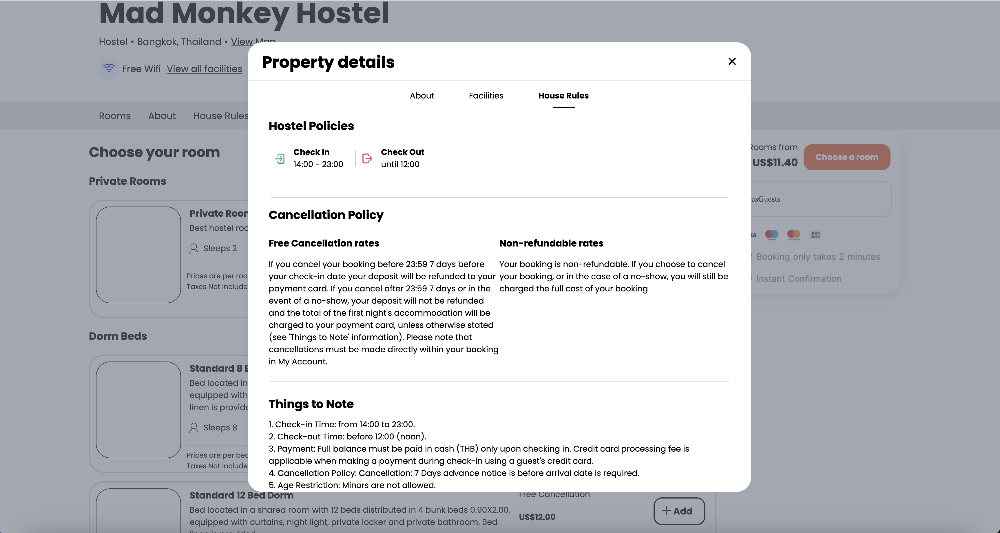

## World of Hostels

World of Hostels is a HostelWorld clone, a booking platform that allows users to book hostels cities accross the world. Catered more towards the backpackers and solo travelers across the world, World of Hostels allows travelers to either book a full private room or a bunk bed in a shared room. It allows more budget friendly options by having multiple users in the same accomadation, coming and going as they please. World of Hostels uses React.js on the frontend and Ruby on Rails on the backend.

https://world-of-hostels.onrender.com

### Technologies and libraries used:

- Ruby on Rails
- JavaScript
- React/Redux
- PostgreSQL
- Amazon Web Storage (AWS)
- HTML
- CSS

### Functionality and MVPS
- Users can sign up for a new account or login to their existing accounts
- Certain features such as booking available only when a user is logged in
- Upon searching for a location, all available rooms are shown on an index page together
- When an accomodation is selected, the user is brought to the listing show page where different room options are shown.

- World of Hostels homepage

- Sign up page for new users

- Property details on the listings show page

